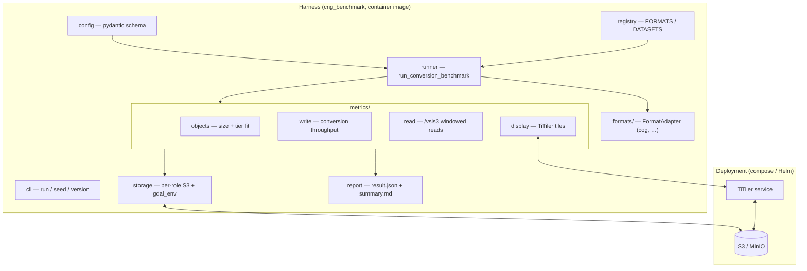
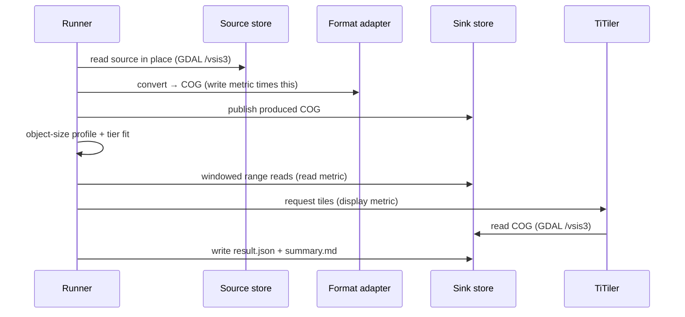
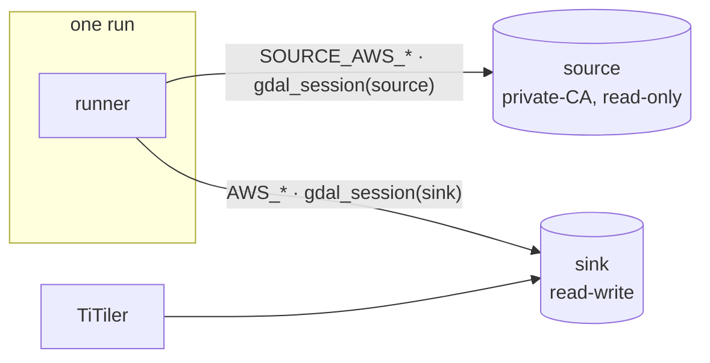

# Architecture

## Principles

1. **A deployable component, not a CI job.** The benchmark runs on real
   infrastructure against real data. CI lints, unit-tests the harness, builds
   the image, and proves the stack *deploys* — it never runs a benchmark.
2. **Datasets and runs are configuration, not code.** Adding a dataset or a
   target format is a new config file plus a registration — never a change to
   CI or the deployment manifests.
3. **The harness is importable and service-free.** All live dependencies
   (TiTiler, object storage) belong to the deployment. The metric logic is unit
   tested in isolation; the geo/S3 libraries are optional extras.

## The two layers

- **Harness** — the Python package, shipped as the runner image
  (`docker/Dockerfile.runner`). The CLI is a thin shell over the runner;
  `FormatAdapter` is the plug-in seam for formats; `config` + `registry` are the
  data-not-code seam.
- **Deployment** — the runner plus its service dependencies, wired by
  docker-compose (local) and the Helm chart (Kubernetes). See
  [Deployment](deployment.md).

## A benchmark run (COG end-to-end)

`run_conversion_benchmark` orchestrates one run. Which metrics execute is driven
by `config.metrics`; the conversion always happens (the other metrics need the
produced object).

The source is read **in place** over the network rather than pre-downloaded, so
the cost of reading out of the (often archived) source is part of the measured
conversion — not laundered away by staging it to fast local disk first.

## Result schema

A run produces a `BenchmarkRun` (`models.py`): the run context (timestamp, tool
versions, dataset/format/params), the first-class `ObjectSizeProfile`
(distribution percentiles, histogram, and tier fitness from `tiers.py`), and a
list of `MetricResult` scalars. It is serialised to `result.json` and rendered
to a human `summary.md` by `report.py`.

## Storage: one provider, or two (source ≠ sink)

S3 settings are resolved per **role** (`storage.s3_profile`):

- **sink** — reads the bare `AWS_*` environment (results, and the produced COG
  that TiTiler serves).
- **source** — reads `SOURCE_AWS_*` and *falls back* to the bare `AWS_*`.

So a single-provider run (the synthetic path: source and sink both the same
store) needs no `SOURCE_*` and behaves exactly as before, while a real run can
read its source from one provider and write its sink to another — each with its
own endpoint, credentials, and CA bundle — in the same process.

GDAL's `/vsis3` configuration is process-global, so per-role config is scoped
with a `rasterio.Env` context manager (`gdal_env.gdal_session`) rather than one
static environment. Only the runner spans two providers — TiTiler only ever
reads the sink.

## Plug-in seams

- **Formats** — a `FormatAdapter` (`formats/base.py`) converts a baseline to a
  target and enumerates the produced objects; it is registered by name in
  `FORMATS` (`registry.py`). The runner resolves the adapter named in the
  config. Adding a format is a new registered subclass.
- **Datasets / benchmarks** — described in `configs/` and validated by the
  `config.py` pydantic schema. Adding one is a new YAML file, picked up by the
  deployment's ConfigMap (Helm) or a mounted file (compose). See
  [Configuration](configuration.md).

## Status & roadmap

| Milestone | State |
| --- | --- |
| M0–M1 — harness skeleton, config schema, object-size metric, tiers | done |
| M2 — deployable stack (compose + Helm), deployability CI, COG end-to-end (write/read/display), two-provider storage | done |
| Real mission — S1/S2 L2A → COG on the lab cluster | gated on external access (CA bundle + egress), then a deploy-time activity |
| M3 — second dataset/format through config only (e.g. SWOT Lake → GeoParquet) + "add a dataset / new target" docs | next |
