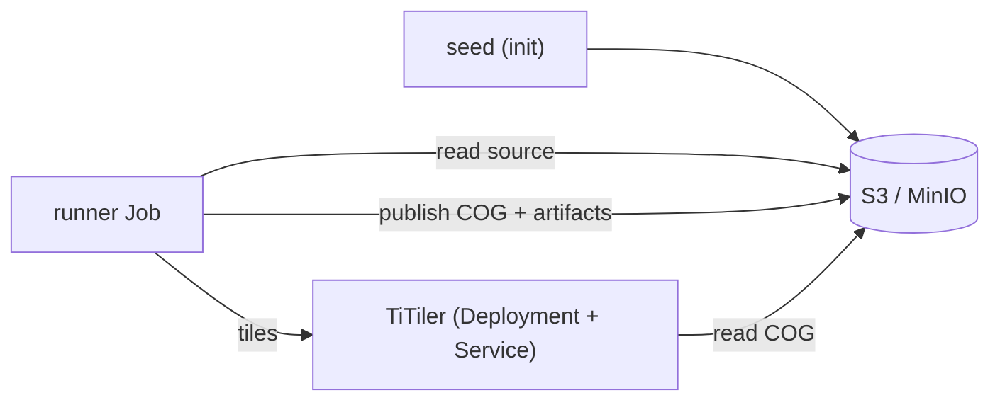

# Deployment

The benchmark system is a deployable stack: the runner image plus its service
dependencies (TiTiler for the display metric, and S3-compatible object storage).
The same stack targets a workstation, an ephemeral CI cluster, and a real
Kubernetes cluster — datasets and runs are configuration, not code.

!!! info "MinIO is a CI/local stand-in only"
    MinIO is a disposable, S3-compatible stand-in used by docker-compose and CI.
    Real runs target real S3 providers; the runner and TiTiler use the *same* S3
    code path against both — only the endpoint and credentials differ. CI never
    runs a benchmark on real data; it only proves the stack deploys.



## docker-compose (local)

`deploy/docker-compose.yml` stands up MinIO + TiTiler + the runner. A seed step
writes a synthetic fixture raster into MinIO; the runner converts it to a COG
and collects the full metric set end-to-end, then writes the produced COG and a
result artifact (`result.json` + `summary.md`) back to MinIO.

```bash
docker build -f docker/Dockerfile.runner -t cng-benchmark-runner:dev .
cd deploy
RUNNER_IMAGE=cng-benchmark-runner:dev docker compose up --wait
# host ports (9000/9001/8000) are inspection-only and overridable:
#   MINIO_PORT=19000 TITILER_PORT=18000 docker compose up --wait
docker compose down -v
```

See [Getting started](getting-started.md#3-run-the-full-stack-end-to-end-local)
for inspecting the result.

## Helm (Kubernetes)

`deploy/helm/cng-benchmark/` deploys the runner as a `Job` (with seed/bucket
initContainers), TiTiler as a `Deployment` + `Service` (probed on `/healthz`),
and the benchmark configs via a `ConfigMap`. MinIO is an optional in-cluster
`Deployment` gated by `minio.enabled`.

| Values file | Target |
| --- | --- |
| `values-local.yaml` | kind + in-cluster MinIO + synthetic fixture (used by CI) |
| `values-lab.yaml` | a real cluster: MinIO off, source ≠ sink, results to external S3 |

```bash
helm lint deploy/helm/cng-benchmark -f deploy/helm/cng-benchmark/values-local.yaml
helm template t deploy/helm/cng-benchmark \
  -f deploy/helm/cng-benchmark/values-local.yaml | kubeconform -strict

kind create cluster --name cngbench
kind load docker-image cng-benchmark-runner:ci --name cngbench
helm install bench deploy/helm/cng-benchmark -f deploy/helm/cng-benchmark/values-local.yaml
kubectl wait --for=condition=complete --timeout=240s job/bench-cng-benchmark-runner
```

### Two providers in one run (source ≠ sink)

A real run reads its **source** from one provider and writes its **sink** to
another. Storage is resolved per role: the `sink` role uses the bare `AWS_*`
environment; the `source` role uses `SOURCE_AWS_*` and falls back to bare
`AWS_*`. So the synthetic single-endpoint path needs no `SOURCE_*` and is
unchanged. In the chart, set `s3` (sink) and optionally `s3Source` — a distinct
read-only source endpoint/credentials plus a private-CA bundle mounted from a
`Secret`. See `values-lab.yaml` for the CNES Datalake source + Scaleway sink
shape; the source is read on the fly via GDAL `/vsis3` (a plain object or a
`/vsizip//vsis3/…` archive member), so the source-read cost is measured, not
hidden by pre-staging.

```bash
# sink (read-write)
kubectl create secret generic cng-benchmark-s3 \
  --from-literal=AWS_ACCESS_KEY_ID=<key> \
  --from-literal=AWS_SECRET_ACCESS_KEY=<secret>
# source (read-only)
kubectl create secret generic cng-benchmark-s3-source \
  --from-literal=AWS_ACCESS_KEY_ID=<key> \
  --from-literal=AWS_SECRET_ACCESS_KEY=<secret>
# source private CA bundle (PEM under key ca-bundle.pem)
kubectl create secret generic cng-datalake-ca \
  --from-file=ca-bundle.pem=/path/to/ca-bundle.pem

helm install bench deploy/helm/cng-benchmark -f deploy/helm/cng-benchmark/values-lab.yaml \
  --set runner.source=s3://datalake-bucket/path/scene.tif \
  --set runner.output=s3://scaleway-bucket/results/
```

A real source on a private CA also requires the cluster's egress to actually
reach that endpoint — an operational prerequisite, not a chart setting.

### Adding a dataset / benchmark

Add the benchmark YAML to the chart's `configs` map and point
`runner.configFile` / `runner.source` / `runner.output` at it — no template or
CI change. For docker-compose, drop the YAML under `configs/benchmarks/` (it is
mounted into the runner) and reference it on the runner command. See
[Configuration](configuration.md).

## Deployability CI

CI proves the stack deploys, never that a benchmark produces a particular
number:

- **deploy-compose** — `docker compose up --wait`, then asserts the result
  artifact landed in MinIO; tears down.
- **deploy-k8s** — spins up an ephemeral kind cluster, loads the built image,
  `helm install`s the local overlay, and asserts TiTiler readiness and the
  runner `Job` reaching `Complete`. `helm lint` + `kubeconform` run on both
  overlays.

Both use only the synthetic fixture — no external data.
