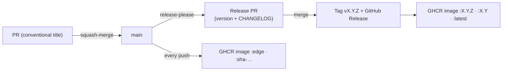

# Releasing

Releases are automated with [release-please](https://github.com/googleapis/release-please):
it reads [Conventional Commits](https://www.conventionalcommits.org/) from
`main`, keeps a **release PR** up to date (version bump + `CHANGELOG.md`), and on
merge tags a GitHub Release and publishes the runner image.

## How a change flows to a release

1. Open a PR with a **Conventional Commit title** (e.g. `feat: …`, `fix: …`,
   `docs: …`). The `PR Title` check enforces this.
2. **Squash-merge** it — the title becomes the single commit on `main`.
3. release-please opens/updates a release PR. Merging it:
   - bumps the version in `pyproject.toml`, `src/cng_benchmark/__init__.py`, and
     the chart's `version` + `appVersion` (one coupled version);
   - updates `CHANGELOG.md`;
   - tags `vX.Y.Z` and creates the GitHub Release;
   - builds and pushes `ghcr.io/developmentseed/cng-benchmark-runner` as
     `:X.Y.Z`, `:X.Y`, and `:latest`.

Every push to `main` also publishes a moving `:edge` (and `:sha-<short>`) image,
so the Helm chart can be deployed against unreleased `main`.

## Versioning & the Helm chart

The chart's `appVersion` tracks the release, and the chart's default
`image.tag` falls back to `appVersion`
([`runnerImage` helper](https://github.com/developmentseed/cng-formats-benchmark/blob/main/deploy/helm/cng-benchmark/templates/_helpers.tpl)).
So a default `helm install` pulls the matching released image; pin
`image.tag` (e.g. `edge`, or a specific `X.Y.Z`) to deploy something else. See
[Deployment](deployment.md).

## Commit types → version bump

| Prefix | Example | Bump |
| --- | --- | --- |
| `feat:` | `feat: add GeoParquet adapter` | minor |
| `fix:` | `fix: correct tier rounding` | patch |
| `feat!:` / `BREAKING CHANGE:` | breaking API change | major |
| `docs:` / `ci:` / `chore:` / `refactor:` / `test:` | housekeeping | none |

## One-time repository settings

These are GitHub settings (not in this repo), required for the automation:

1. **Settings → General → Pull Requests** — enable *Allow squash merging* and set
   the squash *default commit message* to **Pull request title and description**
   (optionally disable merge commits to force squash).
2. **Settings → Actions → General → Workflow permissions** — enable *Allow GitHub
   Actions to create and approve pull requests* (so release-please can open its
   release PR with the default `GITHUB_TOKEN`).
3. After the first publish, set the GHCR package visibility (public if desired)
   and link it to the repository.
